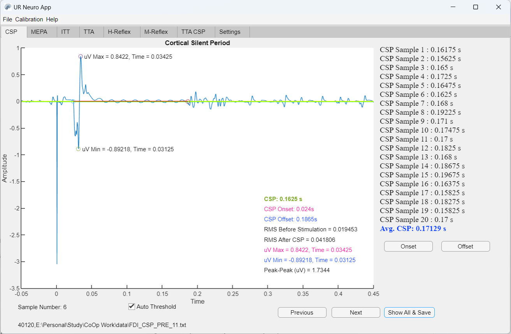
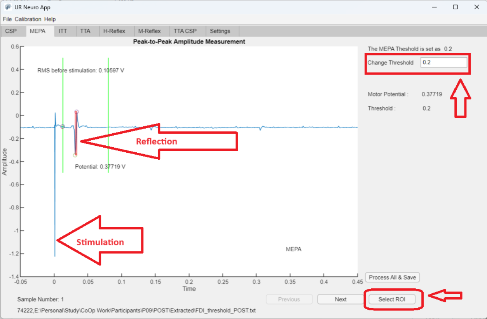
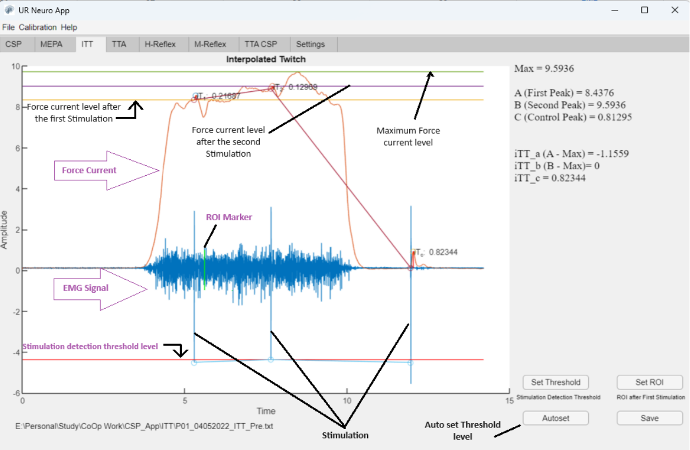
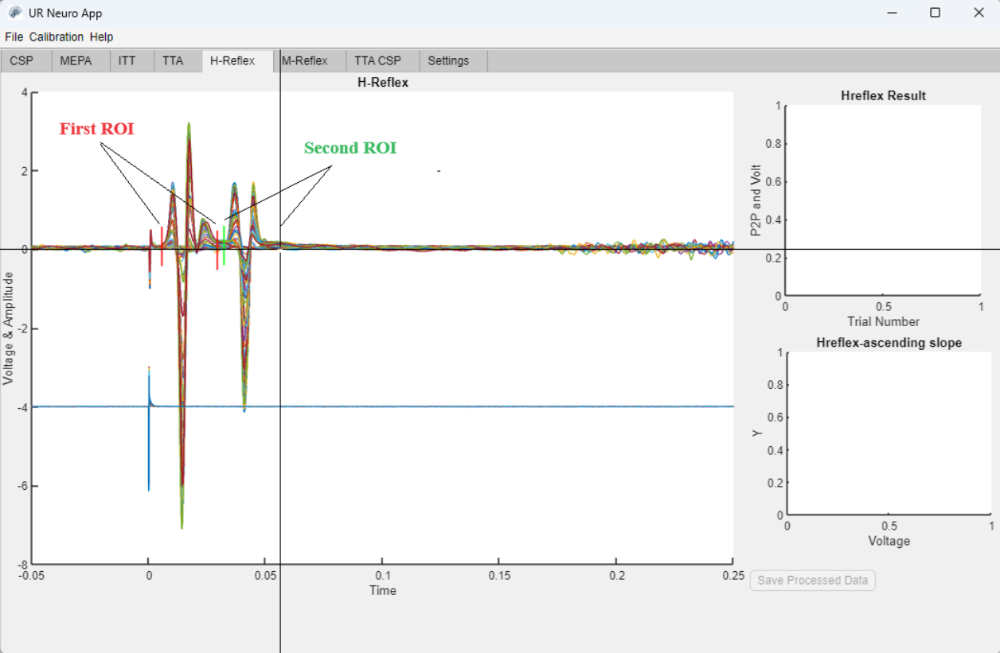
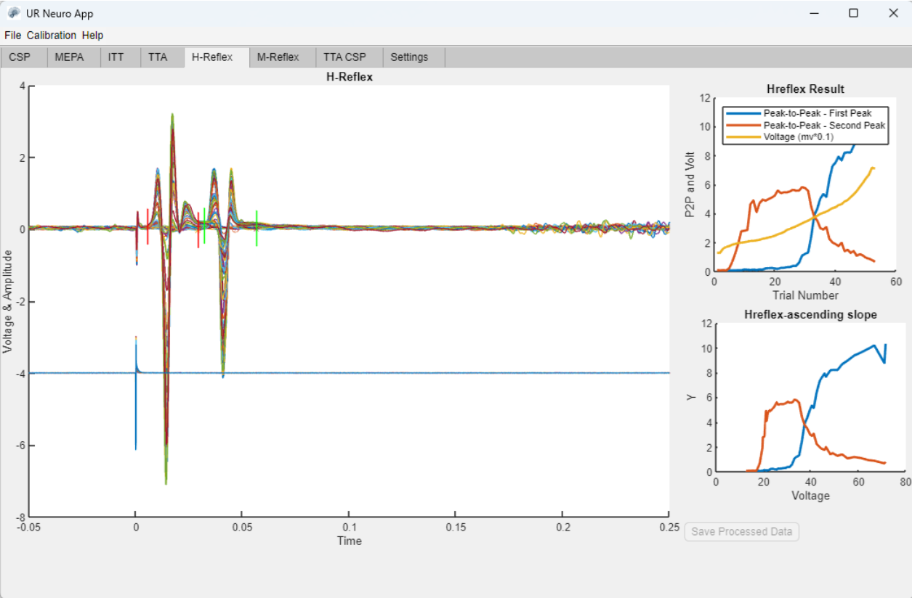
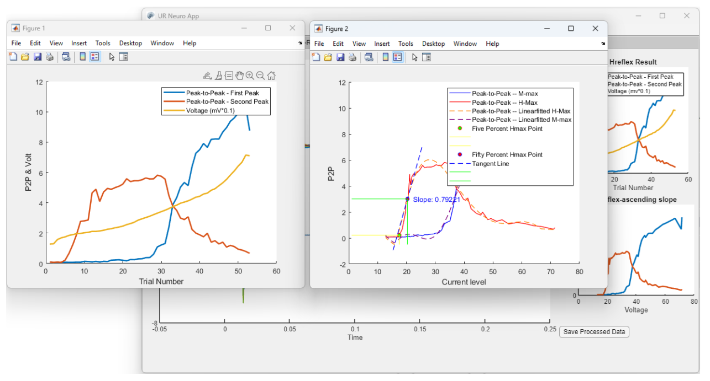

# Cortical Silent Period Analysis App

This application analyzes electromyogram (EMG) signals and measures the duration of the cortical silent period (CSP) elicited by transcranial magnetic stimulation (TMS). It is designed for use in neuroplasticity research.

The application is developed using MATLAB App Designer. To run the software, MATLAB Runtime 9.10 must be installed on your operating system.

This project is funded by the Neuroplasticity & Neurorehabilitation Research Lab at the University of Regina, Canada.

https://drive.google.com/drive/u/0/folders/1AtKwsUIe6fCbBZ9dZL9jxMAtdVGsJAuI

Project Folder: /NewApp

# Cortical-Silent-Period-Analysis:

# MEPA: Motor Evoked Potential Analysis

# Interpolated Twitch (ITT) Analysis:

# H-Reflex:

